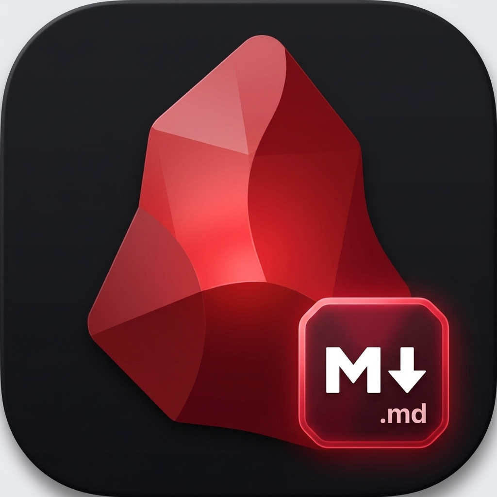

<h1 align="center">
  
  Spinel (<code>spinel.md</code>)
</h1>

<p align="center">
  <strong>The Fast, Local-First, Zero-Knowledge Encrypted Markdown Knowledge Base & Obsidian Alternative.</strong>
</p>

<p align="center">
  <a href="https://palladius.github.io/spinel/"></a>
  <a href="https://github.com/palladius/spinel/actions"></a>
  <a href="https://github.com/palladius/spinel/blob/master/LICENSE"></a>
  <a href="https://flutter.dev"></a>
  <a href="https://go.dev"></a>
  <a href="https://rubyonrails.org"></a>
  <a href="https://cloud.google.com"></a>
</p>

---

## 🌟 What is Spinel?

**Spinel** is an open-source, local-first markdown note-taking environment designed for speed, privacy, and sovereignty. It bridges the elegance of **Obsidian** and **Notion** with the power of modern multiplatform tooling:

- 📂 **Local-First & Transparent**: Your notes remain plain `.md` files on your local drive with standard YAML frontmatter. No proprietary database lock-in.
- 🔒 **Zero-Knowledge Encryption**: All synchronization payloads are client-side encrypted with **AES-256-GCM** before touching the cloud.
- 🖥️ **High-Performance Flutter Desktop/Mobile App**: Obsidian-like live syntax styling, slash commands (`/`), wikilinks (`[[Note]]`), dynamic frontmatter inspectors, and an ultra-dense file tree.
- ⚡ **Standalone Go CLI (`spinel`)**: Blazing-fast full-text indexing, regex search, YAML frontmatter filtering, and instant vault `.tar.gz` export.
- ☁️ **Serverless Rails 8 & Cloud SQL Sync**: Idempotent delta synchronization backend with JSONB indexing deployed on Google Cloud Run via Terraform.

---

## 🚀 Key Features

| Component | Capabilities |
| :--- | :--- |
| **🎨 Live Preview Editor** | Real-time syntax styling, slash command palette (`/`), wikilink autocomplete (`[[`), tag indexing (`#`), and floating formatting bar. |
| **🔄 Cloud Sync & Conflict Resolver** | End-to-end encrypted delta synchronization (`/api/v1/sync/delta`) with interactive 2-pane visual diff resolution (*Keep Local*, *Accept Remote*, *Keep Both*). |
| **📁 Ultra-Dense Vault Tree** | 21px line density with semantic gemstone folder badges (Amber for Daily notes, Sky Blue for Projects, Mint for Resources, Slate for Archive). |
| **🏷️ Frontmatter Inspector** | Graphical modal to inspect, add, and modify YAML key-value arrays and tags without cluttering the main editor. |
| **⚡ Standalone Go CLI** | `spinel init`, `spinel search`, `spinel search-frontmatter`, `spinel export`, and `spinel sync`. |
| **☁️ GCP Infrastructure** | Idempotent Terraform configuration provisioning Cloud SQL PostgreSQL 16, Cloud Run v2, Secret Manager, and least-privilege IAM. |

---

## 🛠️ Quickstart & Development

Spinel uses [`just`](https://github.com/casey/just) to coordinate development across all modules:

```bash
# Clone the repository
git clone git@github.com:palladius/spinel.git
cd spinel

# Run test suite across all 4 components (CLI, Flutter App, Rails 8, Terraform)
just test

# Launch the Flutter desktop app on macOS
just run-app

# Build the standalone Go CLI binary
just build-cli
```

---

## 🏛️ Architecture Overview

```
spinel/
├── app/        # Multiplatform Flutter Desktop & Mobile App (macOS, Linux, iOS, Android)
├── cli/        # Standalone Go CLI tool (spinel init, search, export, sync)
├── server/     # Rails 8 API backend (PostgreSQL JSONB, Cloud Run delta sync)
├── infra/      # Idempotent Google Cloud Terraform modules (Cloud SQL, Cloud Run, IAM)
├── shared/     # Cross-module fixtures and test vault data
└── docs/       # Architecture blueprints, naming studies, and asset branding
```

---

## 📜 License & Credits

Released under the [MIT License](LICENSE). Built with ❤️ by [Riccardo Carlesso](https://github.com/palladius) (@palladius).
